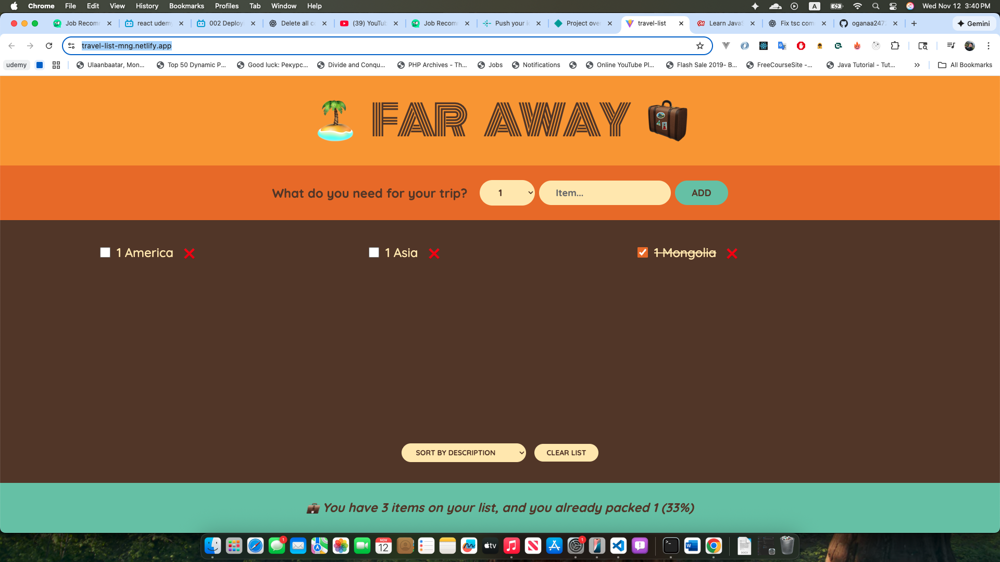

# Travel List App

A simple React app to manage your travel destinations.  
This project demonstrates **state management in React using only `useState`**.

## Features

- Add a new travel destination.
- Mark destinations as visited/unvisited by clicking on them.
- Remove a destination from the list.

## Tech Stack

- React (Functional Components)
- useState for state management
- CSS (inline styles for simplicity)

## Live Demo

Check it out here: [Travel List App](https://travel-list-mng.netlify.app/)



## Getting Started

### 1. Clone the repository
```bash
git clone https://github.com/oganaa2472/travel-list
cd travel-list
